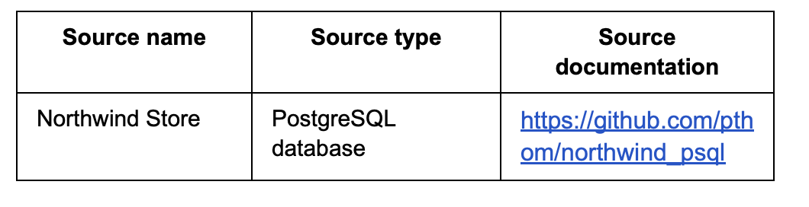
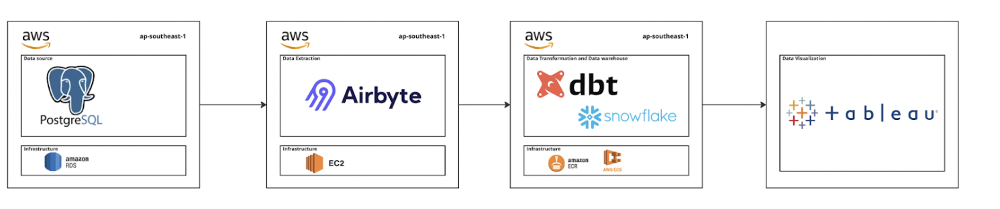
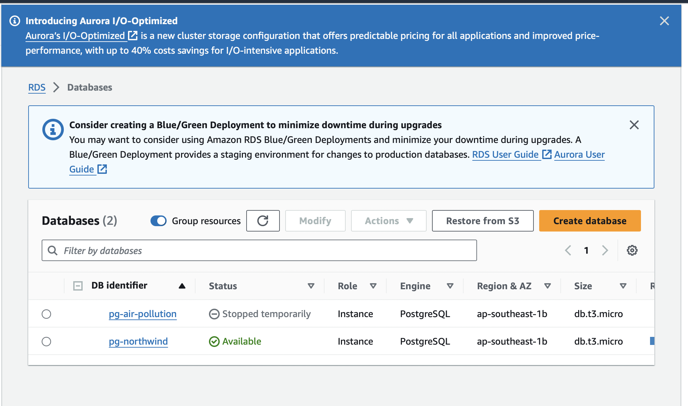
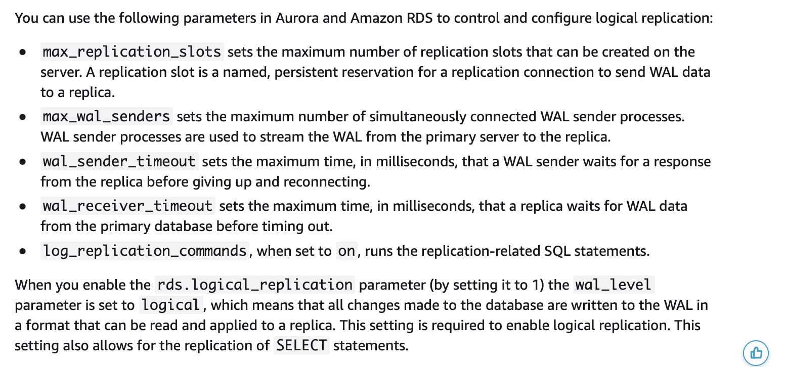

# debootcamp-project2

## Objective
- The objective of our project is to provide analytical evidence to support Northwind Company’s business decisions and gain business insights.

## Questions 
- Orders and Shipping
    - What are the average days to ship for each shipping company?
    - Group countries based on the shipping time 
    - What is the average shipping time for each region compared   to the revenue?
- Sales performance 
    - What is the revenue by product category?
    - Which regions have the highest and lowest sales volumes by product category?
    - Top5 products that have the highest growth and decline in sales.
- Supplier Performance
    - Rank the suppliers based on order qualities?
    - Rank the suppliers that provide the cheapest price for each product category

## Source datasets

## Solution Architecture

## Tools Used
### 1. Postgresql
- The Northwind database is an example of an OLTP system running on PostgreSQL. It features several tables that simulate the operations of a trading company, including Customers (for customer details), Orders (tracking customer orders), Products (listing items for sale), and Suppliers (providing supplier information). We used it for analyzing the company data to answer various business questions mentioned above.

### 2. Snowflake 
- We chose to use Snowflake as our data warehouse because it offers scalable cloud-based architecture and fast query performance with separate storage and compute resources. These features make it ideal for managing and analyzing northwind datasets efficiently in order to make an analysis.

### 3. Airbyte
- Airbyte is used as a tool to extract and integrate data from our source database to our snowflake data warehouse.

### 4. DBT
- We chose DBT as our tool to transform our staging, marts, and reports tables, ensuring each table schema aligns with our designed specifications.

### 5. run_pipeline.sh as Orchestrator
- To orchestrate the integration and transformation processes, we opted to use a bash script to ensure the correct sequence of execution.

### 6. Tableau
- We chose Tableau as our BI tool to visualize and analyze our transformed data.

## Steps of Implementation
### 1. Setup Source Database
- Set up a postgresSQL datbase on AWS RDS and store its credential on AWS Secret Manager.
- Load northwind data from northwind.sql provided on northwind github repo (https://github.com/pthom/northwind_psql)

- Change Data Capture (CDC)
    - Since we chose to use CDC, we need to tuning replication parameters on RDS by using the parameter group. Once the parameter tuning is completed, the reboot of RDS is required to make the change effective. (https://docs.aws.amazon.com/prescriptive-guidance/latest/tuning-postgresql-parameters/replication-parameters.html)
    

### 2. Set up Airbyte 
- Set up airbyte on AWS EC2.

## Limitations and Lessons Learned

